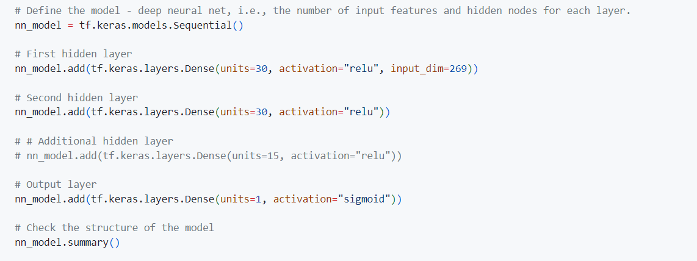

# Report on the Neural Network Model

## Overview 

The goal of the analysis was to develop a deep learning model using a neural network to predict the success of organizations funded by Alphabet Soup. The collected information contains various features of organizations that have received funding, and the target was to create a binary classifier that predicts wheather an organization's funding will be used effectively or not.

## Results

### - Data Preprocessing

• What variable(s) are the target(s) for your model?
The target variable is the "IS SUCCESSFUL" Column, wich indicates wheather the funding was effectively(1) or not(0).

• What variable(s) are the features for your model?
The features used for the model include columns like "NAME", "EIN", "APPLICATION_TYPE," "AFFILIATION," "CLASSIFICATION," "USE_CASE," "ORGANIZATION," "STATUS," "INCOME_AMT," "SPECIAL_CONSIDERATIONS," and "ASK_AMT."

• What variable(s) should be removed from the input data because they are neither targets nor features?
The "EIN" and "NAME" columns were removed from the input data as they are identification columns and not relevant for prediction. However in the optimization process the column "NAME" was added again 

### - Compiling, Training, and Evaluating the Model

• How many neurons, layers, and activation functions did you select for your neural network model, and why?

The model's architecture includes three layers: an input layer with 269 features, two hidden layers with 30 neurons each, and a ReLU activation function. The output layer has one neuron and uses a Sigmoid activation function.

• Were you able to achieve the target model performance?

In the initial model, it was proposed to eliminate the column labeled "NAME". However, the accuracy of the 4-layer model fell below 75%. In the optimization model, the "NAME" column was reintroduced, providing additional features to the model. It is possible that this column contained pertinent information that increased the input dimension, enabling the model to access and process the complete range of available data, leading to more accurate predictions. As a result of this modification, the accuracy improved to 78%.

• What steps did you take in your attempts to increase model performance?

As part of the effort to improve model performance, I investigated a range of strategies to improve predictability. Initially, I increased the number of training epochs, giving the model more opportunities to learn intricate patterns. In addition, I added multiple hidden layers to enhance the model's depth. To prevent overfitting, I used dropout layers to temporarily deactivate certain neurons during training. However, the desired performance enhancement remained elusive. When "NAME" was reintroduced back into the dataset, an important breakthrough emerged. A notable increase in model accuracy was observed after this reintroduction, highlighting how input dimensions impact predictive performance.

## Summary

To summarize, our goal was to create a strong deep learning model that can predict the success of companies funded by Alphabet Soup. We went through a process of preparing the data, designing the model, and optimizing it. We found that the "IS_SUCCESSFUL" column is the target variable that shows whether the funding was used effectively. The model includes various features such as application type, affiliation, classification, and organization details. We tried removing the "NAME" column to simplify the features but found that it didn't improve the model's accuracy. In fact, reintroducing the "NAME" column led to a significant increase in accuracy, showing that the data dimensions play a crucial role. While our model shows promise, achieving high accuracy requires careful consideration. One possible recommendation is to explore ensemble methods like Random Forest or Gradient Boosting, which combine multiple decision trees to create a more robust predictive model using both categorical and numerical features.
